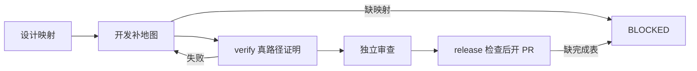

# #18 功能地图与验证门禁

状态：Approved（L1 修订后，用户于 2026-09-18 授权继续端到端至 PR；本文落实该范围）。

## 1 背景

[#18](https://github.com/xforce-io/keel/issues/18) 要求避免仅凭开发测试开 PR。实现、真路径证明与发布之间需要明确合同。

## 2 名词解释

沿用 [名词表](../glossary.md) 的功能地图、keel-verify 与 keel-verify-maintain；无新增术语。

## 3 目标与非目标

目标：每条用户可见 Story 映射功能地图，缺 verify 完成表不得开或合 PR，地图维护独立于交付。
非目标：新增浏览器框架、替换项目测试、改其它应用的手册、合入后健康检查。

## 4 能力

设计点名功能文件；开发补全映射；验证留下入口和证据；发布检查完成表；维护仅修手册。

### 4.1 UI/UX

无新增页面。用户通过 skill 请求观察完成表或 BLOCKED。缺手册、缺映射为阻塞；验证失败回到修复；验证通过后仍须独立审查。无用户路径的 skip 必须可见，不能转成 pass。

## 5 思路与折衷

功能地图是长期维护的产品目录，不是临时测试产物。开发保证覆盖，verify 承担真路径证明，release 检查证据。放弃只在 verify 阻塞的方案，因为直接发布可绕过；放弃以 pytest 表替代驾驶证明。维护独立运行，避免每张票全量回归。

## 6 架构

分层：路由选择环节；环节 skill 定义合同；应用手册定义驾驶路径与证据。

地图维护独立进入 verify-*，不将维护完成表交给 review。

## 7 模块

| 环节 | 输入与通过条件 |
|---|---|
| design | 须写 L2 且有用户可见 Story 时，§11 逐条点名功能文件或索引条目 |
| dev | 每条用户可见 Story 恰好对应一个功能文件或条目；缺项补文件与 README 后才完成 |
| verify | 按手册走映射功能及可能受影响功能的全部入口；表记录 pass/fail/skip、入口、证据路径 |
| release | verify 表全部 pass 或规则允许的 skip，且审查门禁通过；仅 pytest/HTTP 表不足 |
| maintain | 显式名称或维护口语可进入；源码对照仅修改 verify-*；全图/回归再跑全部入口 |

## 8 API/CLI

无新增可执行 CLI。新增 skill 入口 `keel-verify-maintain`；无需 Issue 即可源码对照。「维护循环」同义；「全图 / 回归」额外要求 Live。普通 Issue 验证仍走 keel-verify。

## 9 边界

手册仅认 .agents/skills/verify-* 三件套。多份需选择；缺手册阻塞。明确无用户界面且 S1 是可跑命令时才可 skip「无用户路径」。维护发现产品故障只报告，不用地图修改掩盖。不同 Story 可对应同一功能文件中的不同条目，不要求复制文件。

## 10 迁移/兼容/回滚

已有应用缺地图时会提前在 dev 阻塞；补齐手册后继续，不回退到旧路径。新 skill 由现有安装器发现，无安装协议变化。回滚本次提交恢复旧合同；不删除应用已有功能地图或证据。

## 11 测试计划

本仓库文件/skill 入口由新增 `.agents/skills/verify-keel/features/verify-gates.md` 覆盖，README 单行索引；S1–S4 对应该文件四个验收条目。

| 验收 | E2E 路径与可判定结果 |
|---|---|
| S1 | scratch install 后读取已挂载 dev 合同：缺映射阻塞、补功能文件与 README 才完成，pytest 不替代地图 |
| S2 | 读取已挂载 route/dev/end-to-end 和 release 合同：verify 在 review/release 前；缺表不能开合 PR；无路径 skip 条件明确 |
| S3 | 读取已挂载 design 合同：须写 L2 的用户可见 Story 在 §11 点名文件/条目 |
| S4 | 查找并读取新 skill：单独调用无需 Issue，源码对照与 Live 区分，修改限 verify-*、不进入 review |

这里 E2E 验证交付的文件入口与安装结果，不声称已驱动任意下游 coding-agent 会话。L1 的隔离应用行为场景是合同评审用例；独立审查逐一核对分支，不以文本断言冒充运行时拦截。
Integration：运行 `python3 -m unittest tests.test_keel tests.test_keel_reflect_inspect`，验证 lookup、安装发现与环节合同。修正测试中的宿主 PATH 泄漏、macOS 路径比较及地图枚举，使结果不依赖本机配置。
Unit：N/A，无新增算法。

## 12 开放问题

无。skill 门禁由 coding-agent 遵守，不提供可执行策略引擎；本次不扩展为该能力。

## 13 关联

- [Issue #18](https://github.com/xforce-io/keel/issues/18)
- [L1](https://github.com/xforce-io/keel/issues/18#issuecomment-5727832662)
- 分支：feat/18-verify-map-gates；PR 由 Issue 平台关联。
