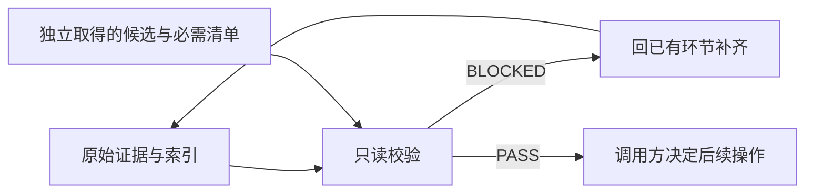

# #20 平台中立的交付证据校验

状态：Approved。用户已批准 L1，并在指出 keel 必须平台中立后确认修订方向、要求端到端完成；本文以该次范围纠偏替代先前 GitHub 受控合入草稿。

## 1 背景

[#20](https://github.com/xforce-io/keel/issues/20) 要求交付证据可检查、缺口可定位。keel 与 CI/托管系统独立，不应内置平台证据采集或合入包装器。现有 skill 继续负责执行各环节，CLI 提供一个只读校验工具。

## 2 名词解释

沿用 [名词表](../glossary.md) 的交付证据索引。它是当前候选与原始证据的关联，不是批准来源。

## 3 目标与非目标

目标：统一输入合同；检查完整性、门禁字段、版本和本地证据摘要；逐项给出阻断及恢复环节。release 在操作前调用工具。

非目标：认证人/模型身份、判断自然语言证据真实、采集 CI、配置工作流或平台保护、执行合入、锁定远端 HEAD、实现宿主适配器或完整调度系统。

## 4 能力

一个 `keel check` 命令，接受索引与调用方独立取得的期望值，不依赖 Git 仓库或网络。文本/JSON 同源；0 通过，1 阻断，2 命令行语法错误。

### 4.1 UI/UX

空/错误：BLOCKED 和缺项、来源位置、下一环节、恢复条件。成功：PASS 明确只代表输入满足合同。skip 显示理由且不变成 pass。主路径：调用方准备证据与期望值 → check → 按失败项回既有环节 → 重新 check → 项目自行决定后续操作。不做页面。

## 5 思路与折衷

一份当前索引；复用原始产物历史；不新增数据库、日志系统或服务。采用 Python 标准库，保持 CLI 单文件，复制安装不引入依赖打包问题。输入合同唯一详细定义在 [校验合同](../../skills/keel-release/references/check.md)，skill 只引用，不复制字段规则。

放弃此前的平台 API、受控合入与宿主记录解析：它们引入平台耦合，超出本 Issue。代价是来源真实性、必需项清单、skip 适用性仍由调用方负责。摘要可发现缺失/变化，不能防止同一调用方同时伪造记录和产物。不将格式校验夸大为完成真实性证明。

## 6 架构

分层：既有环节/项目采集原始证据与当前事实 → 索引和期望值 → CLI 本地校验 → 输出给原路由或项目 CI。无反向执行路径。



读取失败、字段非法、缺项、旧版本、证据摘要不符均阻断；不自动执行或重试。

## 7 模块

`bin/keel` 新增 check 处理及参数入口；不改安装机制。`keel-release` 增加调用责任及失败恢复，引用输入合同。`keel` 入口强调 end-to-end 必经 release，未完成不得宣称交付完成；受阻报告停点、原因和下一步，route/design/dev 保持原停点。该规则仅为路由合同，不声称程序自动拦截，也不放入 cat-mode。项目提供平台结果，工具没有平台分支。示例同时作为测试固定输入，避免维护两份 schema 样例。

## 8 API/CLI

```text
keel check RECORD --issue N --candidate SHA --stories S1,S2 [--required-ci NAME] [--json]
```

字段、skip 条件、退出码和结果结构以 [校验合同 v1](../../skills/keel-release/references/check.md) 为准。Issue、候选、Stories 与必需 CI 均从调用方传入，不能从索引反推。索引有 design、stories、verify、review、ci；所有版本适用项对齐候选，design 另记批准版本。每个证据引用为路径与 SHA-256。

人工门采用独立 `human_approval` 记录：Reviewer PASS 且 human optional 时无需此记录；required 时须有同候选的 approved、批准人和有效本地证据。保留 Reviewer 的 required，不修改其原结论。会话中的真实批准可留存为来源，不要求平台 review。已提供的无效批准即使在 optional 状态也阻断；批准不能覆盖非 PASS 审查或其它失败门禁。此为用户确认修复的闭环缺口，无新增平台集成。

## 9 边界

文件存在且摘要一致不是来源认证，也不是自然语言结论核对。工具不能识别未传入的真实必需项，不能阻止绕过调用或校验后版本变化。调用方在实际操作前重新取得事实并核对现有人工/分支/独立审查规则，不以 CLI 代替自身职责。证据中的命令不执行；URL 不自动访问。

## 10 迁移/兼容/回滚

索引位置由调用方提供，建议项目既有 Git 忽略的验证目录，避免补证据改变 HEAD。旧记录按明确 schema 补全，不自动猜测。安装/doctor/uninstall 保持兼容；copy CLI 独立运行。回滚代码会移除工具及调用要求，不删除任何产物；不宣称回滚后仍有机器校验。

## 11 测试计划

新增 `.agents/skills/verify-keel/features/delivery-gate.md` 的 S1/S2/S3 条目，与本 Issue 一一对应；README 增加单行入口。

| 验收 | E2E 路径和结果 |
|---|---|
| S1 | 隔离目录准备索引与文件，实际 CLI 读取；输出编号与版本关系，调用前后文件不变 |
| S2 | 实际 CLI 运行缺项/旧版本/人工门禁/失效文件/CI 不满足案例，均非零且指向环节；补齐后通过，换候选后旧证据失败 |
| S3 | 实际 help、文本及 JSON、CLI/gui/none 三类样例；前两类不得 skip，无路径有依据可 skip；无 Git 仓库和平台凭据也可运行 |

Integration：子进程 CLI 覆盖上述场景、复制后的 CLI、既有安装生命周期套件。Unit：非法类型/重复键/编号重复/摘要异常/状态组合。只读性通过比较调用前后文件以及确保记录里的命令未执行验证，不用字符串断言冒充运行结果。

命令：`python3 -m unittest tests.test_keel tests.test_keel_reflect_inspect tests.test_keel_check`。驾驶证据另留于被 Git 忽略的验证目录，不以 unittest 输出代替。

## 12 开放问题

无阻断问题。此前的宿主原始记录解析、人类消息鉴别、平台 CI 配置均移出工具职责；调用方承担的信任边界已明确。任何自动采集/平台强制集成应另开需求。

## 13 关联

- [Issue #20](https://github.com/xforce-io/keel/issues/20)
- [L1](https://github.com/xforce-io/keel/issues/20#issuecomment-5746793429)
- 分支 `feat/20-delivery-gate-check`；PR 建立后通过平台关联。
