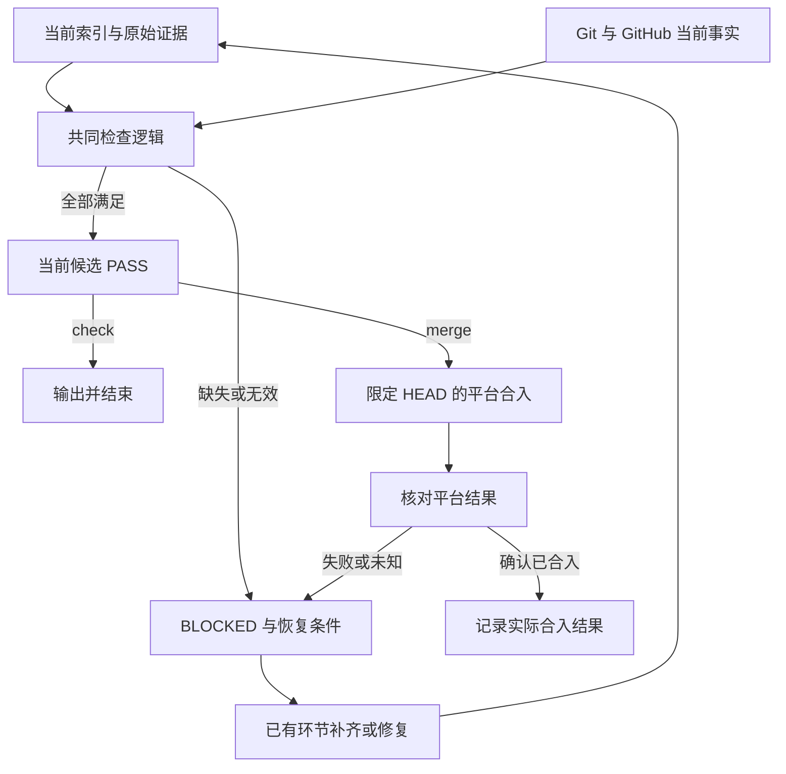

# #20 交付证据校验与受控合入

状态：Draft。L1 已由用户在本会话明确回复 Approved；本文落实获批范围，尚未获批为实现合同。

## 1 背景

[#20](https://github.com/xforce-io/keel/issues/20) 要求阻止 keel 因证据缺失或模型自报完成而误合入。当前 CLI 仅安装、卸载、诊断；验收、验证、审查与发布条件由各环节 skill 描述。新增能力将可机器检查的条件接入实际合入入口。

## 2 名词解释

沿用 [名词表](../glossary.md)。本设计新增“交付证据索引”：按 Issue 关联当前候选版本与原始证据的机器可读文件，不是独立的批准来源。已同步名词表。

## 3 目标与非目标

目标：证据可追溯；阻断发生在合入调用之前；失败指向已有环节；补证据不改变候选提交；通过不等于合入成功。

非目标：完整工作流引擎、常驻进程、数据库、证据签名、自动重试、通用宿主适配框架、自动部署、平台保护配置及阻止绕过 keel 的直接合入。程序不证明审查意见或测试内容必然正确。

## 4 能力

每个 Issue 一份当前交付证据索引；只读检查和受控合入共用同一判定。首期支持 github.com 同仓库 PR，跨仓库 PR、GitLab、GHE 未支持时明确阻断。已存在的安装命令不变。

### 4.1 UI/UX

CLI 主路径为：准备索引 → check 查看逐项结果 → 修复缺项 → merge 重新检查并合入 → 核对平台事实。

| 状态 | 用户看到什么 | 后续 |
|---|---|---|
| 空 | BLOCKED，缺索引或必需来源 | 补指定证据 |
| 无效 | BLOCKED，字段/版本/来源/规则错误 | 回到指定环节 |
| 外部不可用 | BLOCKED，不能核实的来源 | 恢复访问后重试 |
| 检查通过 | PASS，明确仅对本次候选有效 | 可请求受控合入 |
| 合入结果待确认 | BLOCKED，平台状态未确认；不宣称尚未合入 | 先读取平台事实 |
| 合入完成 | MERGED，PR 和实际合入提交 | 本 Issue 合入结束 |

每项显示 pass / fail / skip、原因、来源、下一环节和恢复条件。skip 明示原因，不呈现为通过。没有图形界面；三类任务的区别仅体现在证据要求。

## 5 思路与折衷

- 当前索引放在 Git 工作区之外的 Git 元数据目录，复用原始证据的历史；不另建审计数据库或追加事件流。索引不复制设计、审查正文和日志。
- CLI 不执行索引内记录的测试命令；命令仅是证据上下文，避免把不可信索引当作脚本。
- 判定采用固定字段与显式契约，不让 LLM 再解释一次“是否通过”。非结构化旧证据不能自动猜成合格证据。
- 原始来源核对不是密码学认证。本机文件、宿主导出及平台作者身份分别提供不同强度的依据；不得把摘要或模型名字符串称为独立性证明。
- 恢复只返回已有环节，不新增调度器。skill 管职责，CLI 管可执行条件；不在多个 skill 复制字段表。
- 使用 Python 标准库、Git 与 gh。仅一套 GitHub 路径；不为潜在平台预建接口层级。
- 放弃版本化提交索引（补证据改变 HEAD）、保存长期 PASS 凭证（易过期）和可选检查后裸合入（检查与操作脱节）。

## 6 架构

分层：环节生成原始证据 → 索引关联证据 → CLI 读取本地与 GitHub 事实并判定 → 合入入口携带预期 HEAD 调用平台 → 平台状态核对。



检查不写文件。merge 在调用前重新读取来源、索引及 HEAD，不能消费上次 check 的 PASS。HEAD 由平台执行条件再次约束。人工批准或评论在平台调用瞬间被撤销的竞态无法由 gh 原子锁定，本期只承诺新鲜读取，不承诺所有外部证据的事务一致性。

## 7 模块

| 责任 | 合同 |
|---|---|
| keel-design | 提供适用性、设计版本及真实批准来源 |
| keel-dev | 提供当前干净候选上的逐条验收执行记录 |
| keel-verify | 提供功能映射、各入口结果、原始证据引用或合法 skip |
| keel-review | 提供独立来源、精确目标、三态、human 与现有来源字段 |
| keel-release | 仅经受控 merge 入口合入；不通过平台裸命令兜底 |
| CLI | 读取来源、执行共同检查、输出恢复条件、限定 HEAD 合入和核对结果 |
| keel 路由 | 根据失败项回已有环节；不内嵌规则表 |

CLI 不更换 Reviewer，不从 source 字段自行推断已获人工批准。

## 8 API/CLI

### 命令

```text
keel gate check --issue N [--repo PATH] [--json]
keel gate merge --issue N --strategy merge|squash|rebase [--repo PATH] [--json]
```

PATH 默认当前目录，仓库身份来自 origin。issue 必须为正整数。策略显式提供且符合仓库允许值；不猜默认策略。不提供 force、admin、auto 或跳过门禁参数。

退出码：0 为 check 的 PASS 或 merge 已确认 MERGED；1 为 BLOCKED；2 为参数错误。JSON 输出采用 `schema_version: 1`，包含 `status`、`issue`、`pr`、`candidate_sha`、`checks`、`merge`。每个检查项有稳定 `id`、`status`、`reason`、`source`、`next_stage`、`resume_when`；不适用值用 null。文本与 JSON 来自同一结果，不能判定不同。

### 索引位置与生命周期

默认位置通过 `git rev-parse --git-common-dir` 定位，下面存放 `keel/issues/N.json`；不依赖当前 worktree 的临时目录。不另提供任意文件覆盖入口。所有原始本地引用使用绝对路径；读取时要求普通文件，不自动下载引用或执行内容。

文件为 UTF-8 JSON，顶层 schema_version 固定为 1。缺失或未知版本阻断。环节结束时更新对应引用，使用临时文件替换避免半写；同 Issue 不支持多个写入者并行更新，冲突须重新读取与协调，不能默默合并。记录不随 git clone 自动转移；跨机恢复须复制索引并使来源在目标机器可读，否则阻断。

| 字段 | 必需内容 |
|---|---|
| repository / issue / pr | origin 对应 owner/repo、Issue 号、PR 号；与平台事实一致 |
| candidate | 完整 HEAD SHA、预期 base 分支及 base SHA；不能使用缩写 |
| design | applicable；适用时含设计引用、版本摘要、批准来源；不适用时含理由与规则依据 |
| stories | 每条 S 的 id、pass/fail/skip、运行记录引用、命令、skip 依据 |
| verify | 用户路径分类、功能文件与入口清单、完成记录及原始证据引用，或合法无用户路径依据 |
| review | 原始审查及宿主来源引用；不单独保存可覆盖原始报告的 PASS |
| ci | 项目额外必需检查的受信配置引用；平台要求每次读取，不缓存结果 |
| merge | 合入前为 null；确认成功后记录 PR、原候选 SHA、实际合入 SHA 与来源 |

索引可以更新当前候选，但不能覆盖或伪装旧原始证据。历史由原始运行目录、平台记录或宿主记录保留，本期不提供历史查询命令。merge 结果写入失败时报告“平台已合入、索引写入失败”，再次调用只核对并补记，不再次发起合入。

### 证据来源与可核实边界

所有引用带类型、定位及内容摘要；摘要只能检查内容变化，不能证明作者。验收与验证原始记录至少有 repository、候选 SHA、命令或入口、退出结果及产物引用；独立审查原始结果遵循现有 review 字段并记录目标 SHA。

- GitHub 来源：通过 gh 读取原对象及作者，不把 agent 转述的评论正文当作平台读取结果。批准应能核对到明确的人类批准及被批准版本；版本变化后原批准不能默认适用。
- 本地验收/verify：读取原始运行输出及产物，核对运行记录、版本和结果。文件存在并不证明真实用户路径走完，入口充分性仍由独立审查判断。
- review：需要宿主生成的调用/结果记录，以核对不同上下文、实际宿主/模型、精确目标及报告。实现 agent 自己写出的来源说明或模型自称均不够。首期不建立多宿主导出器；某宿主没有可读取、可解释的原始记录时，明确 BLOCKED，不能退化为任意 JSON 即通过。
- skip 或设计不适用：必须关联批准的范围/规则；有无法通过固定条件判定的适用性争议时阻断，交人，不让模型填写 false 消除门禁。

**落地前置**：review 宿主原始记录的具体读取格式以及人类会话批准的可读取来源尚需确定，见 §12。在该前置未关闭之前，不能宣称首期已有可通过的完整真实路径。

### 必需 CI 与版本检查

必需集合为 GitHub 对目标分支的要求与项目在受信 base 版本声明的额外要求的并集。项目额外列表可为空，但必须可区分“确实为空”和“读取失败”；不得由候选索引自行删除要求。平台报告无必需检查且项目明确无额外项时，显示合法不适用。

结果直接从平台取得并对应候选 HEAD。缺项、失败、取消、进行中及无法获取均阻断；skipped/neutral 不默认等同 success。列表或 base SHA 变化则重新检查。精确的项目声明载体在 §12 收敛，不能为了本功能发明整套策略语言。

本地工作树必须干净，HEAD 与 PR HEAD 相同；分支 Issue 号与任务一致，并遵循项目有效分支约定。验收覆盖 Issue 的全部 S，缺行或重复阻断。review 必须 PASS、human optional、来源字段合法，且没有未处理的硬门禁；required 不因本命令被调用而解除。

### 合入与恢复

合入调用复用 gh 的 `--match-head-commit`；不启用管理员绕过、自动合入或删除分支。要求 merge queue 的仓库本期阻断，不能把入队当 MERGED。平台拒绝或网络错误后先读取 PR：已合入则核对原候选与实际结果；未合入返回阻断；无法读取则明确结果未知。

失败同时输出全部可确定缺口，源读取失败时不凭空生成下游 PASS。恢复优先顺序为 design → dev → verify → review → release；人工/权限缺口只说明等待对象。最多三轮审查仍未通过的既有规则继续适用，不由 CLI 自增重试计数。

## 9 边界

未支持的来源、宿主或平台一律 BLOCKED；索引不含密钥；平台认证沿用 gh。不得自动跟随未知 URL 执行内容或运行证据中的命令。

哈希一致、作者可读、宿主记录存在都不等于防伪认证。本期针对遗漏、版本错误和自报结论，不抵御拥有本机或账号写权限者的恶意篡改。

受控入口只能约束使用它的调用方。skill 仍可能被 agent 忽略，直接调用 gh 不在程序可阻止范围，平台级强制约束需要另行配置保护规则。

## 10 迁移/兼容/回滚

旧任务无索引时阻断；允许关联已有且可核对的来源，不批量迁移为通过。原有安装/卸载/doctor 行为保持兼容。新规则在 release skill 与 CLI 同步交付，避免 skill 调用未安装命令。

回滚代码恢复旧 CLI/skill，但不删除 Git 元数据中的索引或原始证据；必须明确机器门禁随回滚失效，不能报告仍受保护。不提供旧 schema 自动猜测转换。

## 11 测试计划

新增 `.agents/skills/verify-keel/features/delivery-gate.md`，其 S1、S2、S3 条目分别一一对应本 Issue；README 新增一个索引行。更新该手册的 CLI 范围与隔离验证入口，不实际合入本仓库作为测试。

| 验收 | E2E 用户路径及结果 |
|---|---|
| S1 | 隔离仓库准备原始证据和索引 → 实际 check 读取 → 显示完整关联；补证据不改候选 HEAD；错误/不可读来源被点名 |
| S2 | 实际 check 与 merge 入口 → 覆盖 Issue 九组场景 → 在平台写边界记录是否调用；失败零合入调用，通过仅限预期 HEAD；覆盖补证据后通过及代码改变后重新验证审查两条恢复路径 |
| S3 | 实际帮助和三类任务样例 → CLI 与图形界面都要求路径证据，无路径合法 skip 保留原因；文本与 JSON 结论一致 |

E2E 使用实际 Git 仓库与 CLI，平台写边界采用隔离替身，明确这不证明真实 GitHub 写权限或网络。具备经授权的一次性测试仓库时才补真实平台合入，不能用产品仓库合入代替。

Integration：GitHub 响应读取、必需检查空集合与读取失败、宿主原始记录格式、HEAD 竞态、平台拒绝/合入成功但响应丢失、索引补记失败。Unit：编号完整性、状态归并、版本失效、skip 与恢复映射。

安装兼容检查沿用 `python3 -m unittest tests.test_keel tests.test_keel_reflect_inspect`；若新增模块影响 copy 安装，必须验证完整依赖随安装可用。测试不能靠源码包含某字符串来证明入口阻断。

## 12 开放问题

以下是实现前必须关闭的契约缺口，不增加框架掩盖：

1. **首期 review 原始来源**：选定一个可读取的宿主执行记录格式，并实测其能给出调用上下文、实际模型、目标及报告关联。已核对本机 Codex 会话记录存在 session_meta 与 turn_context.model；本地 Codex 源码中的原生 ReviewOutputEvent 只有 findings、overall_correctness、overall_explanation、overall_confidence_score，不包含 keel 的 human 与来源字段。尚未证明审查子上下文的实际模型元数据和完整 keel 结论可关联导出；不能把父会话 model 当审查模型，也不能拍脑袋设计一个让实现者填写的“来源凭证”。
2. **会话批准如何落地**：当前用户在会话中批准了 L1，但由 agent 代写到 GitHub 的评论与人亲自在平台批准不能仅靠账号作者区分。本机会话原始记录已能定位本次 user 角色的 Approved，但本地 Codex 源码也会生成 user 角色的 review 摘要，因此仅检查 role=user 不充分。需同时区分真实用户输入事件与宿主生成记录、绑定批准对象及版本；不能默默将 agent 代写或任意 user 记录视为人工事实。
3. **项目额外 CI 清单**：优先复用项目已有明确声明。若没有，需确定最小声明载体及确认来源，避免首期加入通用策略配置系统。

以上未关闭时，本 L2 保持 Draft，不进入实现。其它格式由本文固定，不继续扩展生命周期实体。

## 13 关联

- [Issue #20](https://github.com/xforce-io/keel/issues/20)
- [已批准的 L1 提案](https://github.com/xforce-io/keel/issues/20#issuecomment-5746793429)
- 分支：`feat/20-delivery-gate-check`；文件名与分支 slug 一致。
- 现有机制：`bin/keel:buildParser` 及 `skills/keel-{dev,verify,review,release}/SKILL.md`。
- PR：尚未创建；当前只交付设计草稿。
