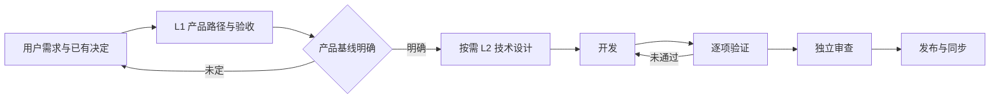

# L1 产品设计：产品与技术两层设计

版本：v1；状态：本次会话确认范围，交付审查中。Issue：[24](https://github.com/xforce-io/keel/issues/24)。确认来源：用户在可评审工作稿交付后明确要求“提交pr merge并 sync”。L2：skip，沿用现有 skill 文件、安装挂载与 check v1，无新增程序接口或运行机制。

## 1. 背景与目标

让 coding agent 在用户路径明确之后设计技术方案，并按同一产品标准证明交付。规范正文见 [设计合同](../../../skills/keel-design/references/design-contract.md)。

## 2. 范围与非目标

覆盖设计、确认、开发、验证、审查、发布的文档合同及其安装可达性。无新增交付环节，不修改 CLI/schema，不实现语义自动验收；本票不执行云端账号同步。

## 3. 用户与产品概念

用户确认产品范围，coding-agent 形成设计与证据，独立 Reviewer 核对契约。术语见 [名词表](../../glossary.md)。

## 4. Product Interaction Overview / 产品交互总览

## 5. 信息架构与入口

沿用 keel、keel-design 及现有下游 skill 入口；新合同由 keel-design/references/design-contract.md 提供。默认设计放在同 Issue 目录的 product.md 与 technical.md，Issue 仅摘要链接。本机沿用已安装挂载。

## 6. Stories 与完整交互

- S1：收到需求后逐份判断 write/reuse/skip，L1 写完整入口、配置、正常及失败路径。已有用户决定复用；缺实质产品决定则完成可评审 L1 并只问未定部分，确认后按需 L2。纯技术变化引用未变产品契约。
- S2：开发使用稳定验收 ID；尚待驾驶验证的项记 not_run 并交接，不提前汇总 pass。验证失败修复后重验；缺依赖记 blocked。全部必需项通过后独立审查与发布核对。标准改变回设计处理。
- S3：旧文档充分则补映射复用，不充分则补受影响产品定义。安装后可从 skill 跳到合同；引用缺失为失败。CLI 与 schema 保持 v1，明确其不检查自然语言验收覆盖。

## 7. 产品规则与边界

R1：不以两份文档增加重复批准；未明确的新产品取舍不能默认为批准。R2：必需项缺行/失败/阻塞/未执行均不能汇总 pass；skip 仅不适用。R3：新旧标题冲突须明确迁移，历史事实不重写。R4：不把文本合同检查称为真实下游产品交付验证。

## 8. 验收与效果验证

全部为本票必需项，执行者为 agent；对本票产品（skill 合同）的真实入口是安装后的文件与引用。主要功能文件：[design-contracts.md](../../../.agents/skills/verify-keel/features/design-contracts.md)。

| ID / 规则 | 前置 | 入口与操作 | 可判定结果及禁止结果 | 证据 |
|---|---|---|---|---|
| S1.A1 / R1 | 新需求及已有决定 | 读取已安装设计 skill → 完整合同与触发/确认规则 | 两层各九节、总览/入口/配置/异常/验收完整；已有确认复用，未定产品不跳到实现 | 安装及合同摘录、对应合同测试 |
| S2.A1 / R2 | 有细化验收 | 读取已安装 dev/verify/review/release → 对照未执行、缺环境、部分通过情形 | 各环节引用同一标准；禁止用 S 汇总掩盖缺失、用 skip 代替未执行；待 verify 可交接但不可报通过 | 四阶段合同摘录、合同测试 |
| S3.A1 / R3/R4 | 隔离安装目录 | install → doctor → 读取设计引用、迁移与 check 说明 → uninstall | 引用存在；旧文档能映射；check v1 不自动核对 L1.8 的边界明确；安装卸载成功 | 原始命令及退出码、文件路径、合同测试 |

无长期效果作为本票交付门槛；本票不声称已验证所有模型在真实项目中遵循合同。

## 9. 折衷与开放问题

采用稳定子项与文档证据，不扩大 schema；因此完整性仍依赖独立审查和调用方核对。后续机器校验另立需求。当前交付无未决产品范围问题。
